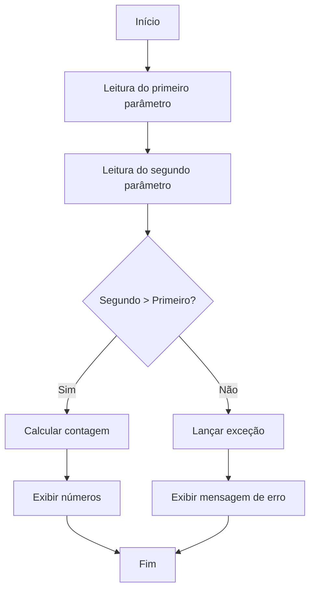

# 🚀 Projeto Contador - Desafio de Controle de Fluxo


## 📋 Descrição

Este projeto foi desenvolvido como parte do desafio de **Controle de Fluxo** do **Bradesco - Java Cloud Native Bootcamp** disponibilizado pela **Digital Innovation One (DIO)**. O programa implementa um contador que recebe dois parâmetros via terminal e realiza a contagem progressiva entre eles, utilizando estruturas de controle de fluxo e tratamento de exceções.

## ✨ Funcionalidades

- ✅ Leitura de dois parâmetros numéricos via terminal
- ✅ Validação de parâmetros (o segundo deve ser maior que o primeiro)
- ✅ Contagem progressiva entre os parâmetros
- ✅ Tratamento de exceções personalizadas
- ✅ Exibição de mensagens informativas durante o processo

## 🛠️ Tecnologias Utilizadas

- Java
- Scanner para entrada de dados
- Estruturas de controle de fluxo (if, for)
- Tratamento de exceções (try-catch)
- Exceções personalizadas

## 🚦 Como Executar

1. Certifique-se de ter o JDK instalado em sua máquina
2. Clone este repositório
3. Navegue até o diretório do projeto
4. Compile o código fonte:
   ```bash
   javac Contador.java ParametrosInvalidosException.java
   ```
5. Execute o programa:
   ```bash
   java Contador
   ```

## 📊 Fluxo do Programa



## 🎯 Especificações do Desafio

Este projeto atende aos requisitos do desafio de Controle de Fluxo do bootcamp, que solicitava a criação de um programa que:

1. Receba dois números inteiros via terminal
2. Realize uma contagem entre esses números
3. Implemente uma exceção personalizada caso o segundo número seja menor que o primeiro

As especificações completas estão disponíveis em: [Desafio DIO](https://github.com/digitalinnovationone/trilha-java-basico/tree/main/desafios/controle-fluxo)

## 💻 Exemplo de Uso

### Cenário de Sucesso:
```
Digite o primeiro parâmetro:
1
Digite o segundo parâmetro:
5
Imprimindo o número 1.
Imprimindo o número 2.
Imprimindo o número 3.
Imprimindo o número 4.
```

### Cenário de Erro:
```
Digite o primeiro parâmetro:
10
Digite o segundo parâmetro:
5
ERRO: ParametrosInvalidosException
O segundo parâmetro deve ser maior que o primeiro.
```

## 🧩 Estrutura do Projeto

```
├── Contador.java           # Classe principal com o método main
└── ParametrosInvalidosException.java  # Exceção personalizada
```

## 📝 Observações

- O programa utiliza a classe `Scanner` para a entrada de dados
- A exceção `ParametrosInvalidosException` é lançada quando o segundo parâmetro é menor que o primeiro
- O código implementa uma solução de contagem através de um loop for

## 👤 Autor
Lucas Rodrigues Braga
